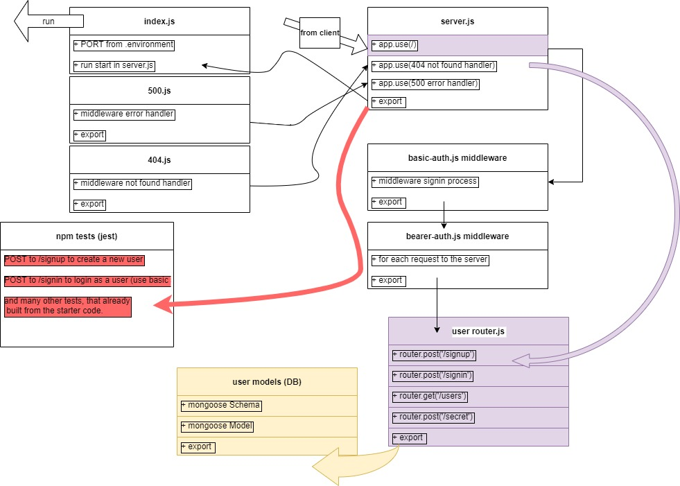

# bearer-auth

**Author: Ahmad Abu Osbeh**
<br>

- tests report
- back-end

**Setup**
<br>

- .env requirements
- PORT - 3003
- Running the app
- npm start
- Endpoint:

```
data should be:
 const obj = {
    username: 'ahmad',
    password: '1234',
  };

```

**example hit :**
[sign up](https://ahmad-osbeh-basic-auth.herokuapp.com/api/v1/signup)

- https://ahmad-osbeh-basic-auth.herokuapp.com/api/v1/signup

**example hit :**
[signin](https://ahmad-osbeh-basic-auth.herokuapp.com/api/v1/signin)

- https://ahmad-osbeh-basic-auth.herokuapp.com/api/v1/signin

- Returns : json with requested data

```

{
"domain": "https://ahmad-osbeh-basic-auth.herokuapp.com/",
"status": "running",
"port": 3003
}

```

# PR link

[PR link](https://github.com/Ahmad-AbuOsbeh/basic-auth/pull/1)

**Tests**

**using supertest and jest**

- Unit Tests: npm run test

# UML

<br>


